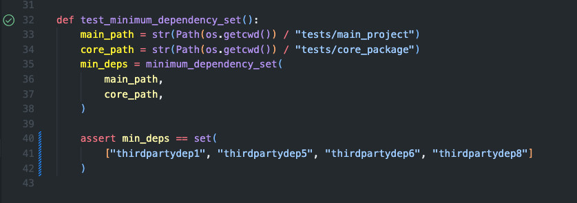

# Pack: Python Packages Packer

Internal core packages quickly grow out of hand with multiple teams contributing to them and sharing them across services, infrastructure, and scripts.

When someone starts a new project and adds the core package as a dependency, the environment/image size instantly increases by hundreds of megabytes or gigabytes.

### Notice 

If only a single independent constant was imported, the whole package needs to be added as a dependency. Is that really necessary? The new project has no use for 99.9% of the internal package code.

Optimally, the solution would be to split the package into smaller packages. Realistically, this is very hard to achieve because of 1) cross-dependencies, 2) having to refactor MANY projects/scripts/pipelines as well as developer and onboarding tools/documents.

### A solution?

If we knew what parts of a package are needed in a project, then we could technically analyze the dependency graph and prune everything that isn’t needed before installing! Poetry allows 'extras' specification, which we can leverage here.

Smaller environments means less installation time, faster CI/CD pipelines, happier developers, and less storage space needed for installed packages.

In the very first trial of v0.0 of this, build times were reduced from 4 minutes to 10 seconds. In my case, the core package was not even that large (~700MB), which was reduced to 10MB only by installing only some of the dependencies.

### Some terminology
`Core package`: the package that is to be pruned of unnecessary dependencies
`Main project`: the project that depends on the core package.

### How it works
- Scan all the files in the main project and list modules needed from core package
- Find the dependencies needed by those important modules
- Handle nested dependencies in core package
- Return a list of the minimum required dependencies to make the core package work in this project
- Update the core package's pyproject.toml file with all-optional packages, and an extra section for this project specifying the minimum required deps.

### TODO:
[X] Create a function to calculate the minimum dependencies required by a core package to work within a project based on what parts are used
[ ] Create a command line interface to this function and more
[ ] Create a function that updates a pyproject.toml file as specified above
[ ] Look into pip requirements.txt support
[ ] Possibly calculate example dev impact, environmental impact of time saved in builds, as well as example storage space saved

### Tests
Here is an example test with some slightly complicated dependencies. You can see how the set of dependencies needed by the project to work is returned, and `secondary_utils.py`'s dependencies are ignored since this file is not imported into main_project.

